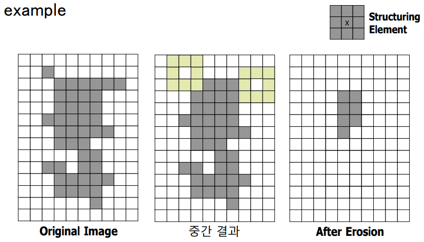

## 01. 2차원 신호의 디지털화 과정

*금오공과대학교 김성영교수님 자료를 참고했음을 밝힙니다.*

- 관련 용어 정리

  - Cartesian coordinate & Polar coordinate: 데카르트 좌표, 극 좌표

  - PPI : pixel per inch

  - DPI : dots per inch

  - uint8 : unsigned interger 2**8  = 256 (영상을 표현할 때 사용)

  - float32 : 영상을 연산할 때 사용 

    

- 영상 신호의 디지털화 과정
  - sampling(표본화)
    - 원래의 신호(아날로그)는 선형(linear)적인 신호이다. 
    - 하지만 우리가 저장을 할때는 무한대로 저장을 할 수 없기에 아주 짧은 시간으로 신호를 쪼개어 저장하고 이를 sampling이라고 한다.
    - sampling 주기가 짧아지면 신호의 퀄리티는 올라가고 용량은 늘어나는 등의 상충관계가 있다.
    - picture element, pixel, pel 화소: sampling  단위
  - quantizing(양자화)
    - pixel 하나에 대한 이야기, 상이 어떻게 맺힐 것인가 하는 이야기
    - 양자화라는 것은 무한대로 이루어진 셀 수 없는 아날로그 정보를 셀 수 있을 만큼의 간격으로 만들어서 유의미한 정보만을 사용하는 것이다. 이 말은 샘플링에도 유효할 것이다.
    - 양자화는 Level 단위로 나타내는데 Level이 높을 수록(더 세밀하게 잘라서 밝기값 혹은 컬러값을 표현할수록) 원래의 영상에 가깝게 이미지가 표현되는 것을 볼 수 있다.
  - coding(부호화)
    - jpg : lossg (손실 압축)
    - png : 무손실 압축

## 02. 디지털 영상의 구조 및 유형

- 학습목표 
  - 디지털 영상(bitmap)의 표현 방법을 설명할 수 있다. 
  - 디지털 영상(bitmap)의 유형(mode)을 구분하여 설명할 수 있다

- 디지털 영상의 표현 방법
  - 영상 좌표 (x, y)

  - 행렬 위치 (r, c)

  - 두 좌표계 표현방법이 서로 뒤집혀? 있기에 조심해야한다.

  - x, y: spatial coordinates

  - I: intensity (gray level) 흑백 표현

  - Ir , Ig,  Ib  컬러도 표현

  - dithering: 제한된 색을 이용하여 음영이나 색을 나타내는 것이며, 여러 컬러의 색을 최대한 맞추는 과정 / 점을 찍는 과정에서 밀도를 바꿔서 검흰회색을 표현하는 것?

  - Halftoning: **망점**(網點)은 점을 사용하여 크기나 간격에 따라 연속 색조의 상을 따라 만드는 복사(複寫) 기법이나 점으로, 그라디언트와 같은 효과를 낸다. 색을 표현할 때  여러 dot을 이용하여 표현하는 것

  - color image -> true color image : typically 24 bit / pixel 사실적인 컬러를 표현

  - color image -> indexed color image 8bit / pixel 데이터를 줄이기 위해서 사용
    - gif같은 것이다. 영상처리할때 gif같은 건 사용하지 않는게 좋다. 만화나 움짤 같은 재미요소를 위해 사용하는 데이터이다.

  - muti-spectral image
    $$
    적외선 > 825nm > \lambda > 380nm > 자외선
    $$
    

## 04. 영상 처리 및 컴퓨터 비전 개요

- 학습내용

  - Computer Vision
  - Image Processing

- Computer Vision

  - Patter Recognition

    - input object(pattern)를 주어진 algoirthim에 의해 catrgory나 class로 classification하는 과정

    - Image enhancement → image segmentation → feature extraction →  pattern classificatio

    - 사과와 바나나를 구분할 때 사용할 feature를 생각해보자

      - ex) 1. color
        $$
        2. thinness ratio = 4\pi r^2 / p^2
        $$

    - 

    $$
    p = 2\pi r^2
    $$

    

    

  - Image Processing

    - 인간이 사용하기 편하도록 컴퓨터를 사용하여 기존 영상을 개선하고나 수정하는 학문 분야
    - image restoration: 왜곡된 이미지를 복원하는 것
    - image enhancement: 상태를 좋게 만드는 것 
    - image compression: 이미지 데이터 양을 줄이는 것

## Point Operation

### Arithmetic Operation & Grayscale Transformation

- Point Operation
  - 각 픽셀 값을 새 값을 포함한 값으로 대체하는 것
  - 픽셀에 산술적 연산을 통해서 얻을 수 있는 것
    - image contrast: 대조도, 각픽셀 별로 차이가 크게 나게 되면 더 잘 인식할 수 있게 된다.
    - image brightness: 말그대로 밝기 이다.
    - 
    - 히스토그램의 가로축은 intensity 세로축은 frequency이다.
    - 1번 그림은 밝기, 대조도가 적당하다.(대역이 넓음)
    - 2번 그림은 밝기가  어두우면서 대조도가 낮아서 구분이 힘들다.(대역이 좁음)
    - 3번 그림은 밝기가  밝으면서 대조도가 낮아서 구분이 힘들다.(대역이 좁음)
  
- Scalar Arithmetic Operation
  - 
  - 클리핑 기법: 어떤 배열을 대상으로 하여 배열 내 모든 값들 중 **특정한 범위 내에 속하는 것들은 그대로 살리고 범위 바깥에 속하는 것들은 범위 경계값으로 대체하는 기법**이다.
  - level 변화
    - 
    - level이 상승해서 밝기가 변화하지만 원래는 대역 자체는 변하지 않는다 하지만 클리핑 처리로 인한 경계값의 대조도는 변화가 있다.
  - gain 변화
    - 
    - gain이 상승할때는 intesity가 낮은 곳에는 상대적으로 변화가 적다 절대적인 값이 작기 때문이다. 그래서 밝은 부분이 영향을 많이 받는다.
  
- Image Arithmetic Operation
  - Averaging(salt & pepper noise)
    - 
    - 소금 후추 뿌린것 처럼 노이즈가 있다. 여러 사진을 합치고 평균을 내어서 노이즈를 제거할 수 있다.
  
  - Difference(지능형 cctv)
    - 
    - 이미지의 차이점을 확인하기 위해 빼기 연산을 이미지에 적용한다.
  
  - GRAYSCALE TRANSFORMATION
  
    - 결국 image의 brightness와 contrast를 향상시키기 위함이다. mapping function을 사용하여 
  
    - $$
      o(x,y) = M[I(x,y)]
      $$
  
      
  
    - 특정 대역을 같는 부분을 향상시키는 예제
  
      - 
      - 
      - 위와 같이 특정 대역을 넘으면 255, 특정 대역 아래이면 0, 가운데 대역 폭은 기울기를 크게 가지면 이미지의  contrast가 향상될 것 같다.
  
    - 
  
  - Processing for color images
  
    - 일반 적으로 rgb 영역에서 hsi 영역으로 바꾼뒤 처리를 해준다.

### Point Operation

- Histogram Modification
  - 히스토그램을 기반으로 image의 contrast와 brightness를 향상시키는 것
  - 
  - histogram stretching은 image shape이 바뀌지 않는다.
  - histogram equlization은 image shape이 바뀐다.
  - histogram stretching = histogram normalization
    - 
    - 비례식을 사용하면 어렵지 않게 이해할 수 있다.
    - 
  - equalization
    - Focus on the histogram **shape** and **range** 
    - 
    - 균일 분포로 바꿔주는 것 image가 향상된다.
    - 누적분포 함수(CDF: Cumulative Distribution Function)
    - 
    - 
    - 

### Point Operation

- Grayscale Thresholding
- 
- Binarization: 이진화
- 
- Threshold의 결정
  - 
  - 어떻게 하면 잘 자를 수 있을까?
    - OTSU라는 방법이 있다.
    - 임계값 T를 기준으로 영역을 2개 그룹으로 나누었을 때 각 집합내 의 **명암 분포는 균일**하고 집합 사이의 **명암 차이는 최대화**될 수 있 도록 함 
    - 모든 가능한 T에 대해 점수를 계산하여 가장 좋은 T를 최종 임계값 으로 선택함 ---> 최적화 알고리즘 (optimization algorithm) 
      - 낱낱 탐색 (exhaustive search), 언덕 오르기 (hill climbing) 등의 탐색 방 법을 사용 가능
    - 최적화 알고리즘에서는 비용 함수 (cost function) 또는 목적 함수 (objective function)을 사용하여 점수 계산
    - 목적함수
      - 

### Morphology

- Morphology:(형태학)
  - 생물학의 한 분야로 동물이나 식물의 모양이나 구조를 다루는 학문
- 수학적 몰폴로지, 이미지 몰폴로지
  - 관심 객체의 검출을 쉽게 처리할 수 있도록 영상 분할 결과를 단순 화하는 방법으로 사용
  - 객체 경계의 단순화, 작은 구멍을 채움, 작은 돌기의 제거 등
  - Binary 영상과 Gray-scale 영상에 적용 가능
  - 모폴로지 필터링morphological filtering
    - 구조적 요소structuring element와 **팽창dilation** 및 **침식erosion** 연산 사용
- 이진 영상에서의 팽장 연산 Dilation operation
  - 객체의 크기를 확장
    - 객체 내부의 작은 구멍을 채움
    - 근접한 위치의 두 객체를 연결
    - 
    - 위 사진은 4연결성이다. anchor point에서 연산이 발생한다.
    - 
    - 위 사진은 8연결성이다.
    - 
- 이진 영상에서의 침식 연산(Erosion operation)
  - 객체의 크기를 축소
    - 객체 경계를 침식
    - 작은돌기를 제거
    - 
    - 
    - 
    - 위와 같이 밖의 결측치를 제거할 수 있다.
- 열림 연산
  - 침식 연산을 수행한 후 다시 팽창 연상 적용
  - 작은 크기의 객체에 포함되는 픽셀들을 제거
  - 
- 닫힘 연산
  - 팽창 연산을 수행한 후 다시 침식 연산을 적용
  - 객체 내부의 작은 구명이나 간격을 채움
  - 
  - 

### Geometric Transform

- Geometric Transforms(기하학적 변환)
  - Spatial transform(공간 변환)
  - Gray-level interpolation

- Geometric Transforms 개요
  - 수식이나 변환 관계에 의해 **픽셀들의 위치**를 변견하는 변환
  - 두 단계의 처리 단계로 구성
    1. mapping by spatial transform (데이터를 늘린다.)
    2. gray-level interpolation (데이터를 늘리면서 생기는 빈공간을 채운다,)
       - 
       - 인풋 영상의 어떤 x,y에서 가져와서 interpolation 연산을 거쳐서 사용한다.
  - Spatial Transform
    - 
    - Affine(linear) Transform : 위 4개 방식을 합쳐서 부르는 말
  - forward mapping
    - 변환 수식에 의해 입력좌표를 출력좌표로 변환하는 과정
    - 출력 영상에서 정의되지 않은 픽셀(hole) 발생, 해당 좌표값이 사라지는 것을 뜻함
    - 
  - backward mapping
    - 출력 영상의 각픽셀 좌표에 대응하는 원본 영상의 좌표 를 계산하여 해당 픽셀의 밝기 값을 결정하는 방법
    - 출력 영상에서 정의되지 않은 픽셀 발생 방지
    - 계산된 좌표가 정수가 하는 경우 발생 -> interpolation 적용
    - 주로 backward mapping을 사용한다.
  - foward vs backward mapping
    - 
  - Affine trainsform
    - Linear transform
    - 휘어짐이 없고 평행한 선들은 평행을 유지하는 병환
    - 이동, 회전, 스케일 및 이들의 조합에 의한 변환
    - 
    - 
    - translation
      - 
    - rotation
      - 
      - 
    - scaling
      - 
    - skew
      - 
    - 
  - Warping
    - Nonlinear transform (rbber sheet transform)
    - pixel 별로 이동 정도를 다르게 할 수 있어서 고무판 위에 그려진 영상을 임의대로 구부리는 것과 같은 효과를 낼 수 있음
    - 고차항을 사용하여 일반화된 다항식으로 표현
    - n^th order warpping으로 표현하곤하는데  차수가 높을 수록 왜곡률이 높다.

- Interploation

  - interpolation 이란?

    - 결과 픽셀에 정확하게 대응되는 입력 픽셀이 없는 경우 주변 픽셀들 을 고려하여 새로운 값을 생성하는 방법

  - interpolation 종류

    - Nearest neighbor interpolation
    - Neighbor averaging interpolation
    - Bilinear interpolation
    - Higher order interpolation

  - Nearest neighbor interpolation

    - 계산한 위치에서 가장 가까운 원시 픽셀을 선택하는 방 법
    - 처리 속도는 빠르지만 결과 영상의 질이 좋지 않음
    - 

  - Neighbor averaging interpolation

    - Find a neighborhood average
    - Two dimensionally using all four neighbors
    - More computationally intensive but provide more  visually pleasing result
    - 

  - Bilinear interpolation

    - 
    - 거리에 따른 가중치를 통해서 결정할 수 있다.

  - 결과 비교

    - 

      

### Color

- RGB 모델
  - 빛의 삼원색인 빨간색, 초록색 , 파란색을 기본 색(primary  color)으로 사용
  - 표현 가능한 모든 색은 단위 크기의 육면체(cube)를 사용 하여 표현 가능
  - 
  - RGB 모델에서 특정 색을 뽑아내는 것은 어렵다 이유는 rgb색이 섞여있기 때문이다.
  - 평활화를 equalizaion을 적용하는 것도 어렵다 밝기 정도를 조절해야하는데 섞여있기에 어렵기 때문이다.
  - RGB to Gray-scale 변환
    - TV 또는 모니터 등에서 사용
      - Y = 0.299𝐑 + 0.587𝐆 + 0.114**B** = 3:6:1
    - 나머지 응용에서 사용
      - Y = 0.333𝐑 + 0.333𝐆 + 0.333**B** = 1:1:1
- CMY 모델
  - 색의 삼원색인 청록색, 자홍색, 노란색을 기본 색으로 사용
  - 표현 가능한 모든 색은 단위 크기의 육면체(cube)로 표현
  - 물체에서 일부 파장이 흡수되고 나머지 파장은 반사되어 관측자에 도달하는 방식에 대한 색의 표현
  - 

- HSV 모델
  - 색상(hue), 채도(saturation), 명도(value)를 기본 색으로 사용
    - 색상은 색의 주 파장을 구분하는 특징
    - 채도는 색의 순수성(purity)을 구분하는 특징
      - 순색에 백색광이 혼합된 정도를 나타냄
      - 색상에 백색광이 혼합될수록 색의 순수성은 감소하여 채도는 낮아짐
    - 명도는 색의 밝고 어두운 정도를 구분하는 값
      - 명도 채널이 따로 있기에 우리가 원하는 명도를 변경하는 연산을 처리할 수 있다.
  - 실린더 좌표(cylindrical coordinate) 사용해 모든 색 표현
    - Color = Brightness + Chromaticity
  - 
  - 색상(hue) 채널은 0 ~ 179까지 이다 이휴는 0도에서 360도 이지만 8비트 연산이기에 255까지 밖에 나타내지 못하기에 2도씩 묶어서 나타낸다.
- HSL 모델
  - H는 색상(hue), S는 채도(saturation), L은 밝기(lightness)를 기본 색으로 사용
  - 두 개의 원뿔을 맞붙여 놓은 형태로 표현
  - 
  - 이런 모델도 있지만 우리는 이미지 프로세싱할 때는 HSV정도 적용하면 된다고 한다.
- YCbCr모델
  - Y: 밝기,  (Cr, Cr): 색깔
  - 영상 및 비디오 압축(JPEG, MPEG 등)에서 주로 사용
  - Y 성분: 휘도(luminance), Cb & Cr 성분: 색차(chrominance)
  - 휘도
    - Y = krR + kgG + kbB
  - 색차
    - 색도 성분은 R, G, B 성분과 Y 성분의 차이(color difference)로 표현
    - Cb = B – Y, Cr = R – Y, Cg = G – Y

