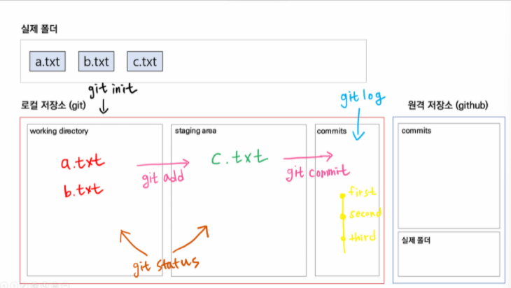

# GIT 특강 21.12.21

- GUI vs CLI
  - CLI (Command Line Interface) : 터미널을 통해 사용자와 컴퓨터가 상호 작용하는 방식
  - GUI (Graphic User Interface) : 그래픽을 통해 사용자와 컴퓨터가 상호 작용하는 방식


- CLI를 사용하는 이유
  1. 단계가 간단하다.
  2. 컴퓨터의 성능을 적게 소모한다.


- 절대 경로와 상대 경로
  1. 절대 경로: 루트 디렉토리부터 목적 지점까지 거치는 모든 경로를 전부 작성한 것
  2. 상대 경로: 현재 작업하고 있는 디렉토리를 기준으로 계산된 상대적 위치를 작성한 것
  3.  `./`   : 현재 작업하고 있는 폴더를 의미한다.
  4. `../` : 현재 작업하고 있는 폴더의 부모 폴더를 의미한다.


- 터미널 명령어

  1. ```bash
     touch
     ```

     - 파일을 생성하는 명령어

     - 띄어쓰기로 구분하여 여러 파일을 한꺼번에 생성 가능합니다.

     - 숨김 파일을 만들기 위해서 `.`을 파일 명 앞에 붙입니다.

     - ```bash
       $ touch text.txt
       ```

  2. ```bash
     mkdir
     ```

     - make directory
     - 새 폴더를 생서하는 명령어
     - 띄어쓰기로 구분하여 여러 폴더를 한꺼번에 생성 가능합니다.
     - 폴더 이름 사이에 공백을 넣고 싶다면 따옴 표로 묶어서 입력합니다.

  3. ```bash
     ls
     ```

     - list segments
     - 현재 작업 중인 디렉토리의 폴더/파일 목록을 보여주는 명령어
     - `-a` : all 옵션, 숨김 파일까지 모두 보여준다.
     - `-l` : long 옵션. 용량, 수정 날짜 등 파일 정보를 자제히 보여준다. 

  4. `mv`

     - move
     - 폴더/파일을 다른 폴더 내로 이동 하거나 이름을 변경하는 명령어
     - 단, 다른 폴더로 이동할 때는 작성한 폴더가 반드시 있어야 합니다. 없으면 이름이 바뀝니다.

     ```bash
     # text.txt를 folder 폴더 안에 넣을 때
     $ mv text.txt folder
     
     # text1.txt의 이름을 text2.txt로 바꿀 때
     $ mv text1.txt text2.txt
     ```

  5. `cd`

     - change directory
     - 현재 작업 중인 디렉토리를 변경하는 명령어
     - `cd ~` 를 입력하면 홈 디렉토리로 이동합니다. (단순히 `cd` 라고만 입력해도 동일합니다.)
     - `cd ..` 를 입력하면 부모 디렉토리로 이동합니다. (위로 가기)
     - `cd -` 를 입력하면 바로 전 디렉토리로 이동합니다. (뒤로 가기)

     ```bash
     # 현재 작업 중인 디렉토리에 있는 folder 폴더로 이동
     $ cd folder
     
     # 절대 경로를 통한 디렉토리 변경
     $ cd C:/Users/kyle/Desktop
     
     # 상대 경로를 통한 디렉토리 변경
     $ cd ../parent/child
     ```

  6. `rm`

     - remove
     - 폴더/파일 지우는 명령어
     - GUI와 달리 휴지통으로 이동하지 않고, 바로 `완전 삭제`합니다.
     - `*(asterisk, wildcard)`를 사용해서 `rm *.txt` 라고 입력하면 txt 파일 전체를 다 지웁니다.
     - `-r` : recursive 옵션. 폴더를 지울 때 사용합니다.

     ```bash
     $ rm test.txt
     $ rm -r folder
     ```

  7. `start, open`

     - 폴더/파일을 여는 명령어
     - `Windows`에서는 start를, `Mac`에서는 open을 사용할 수 있습니다.

     ```bash
     # Windows
     $ start test.txt
     
     # Mac
     $ open test.txt
     ```

  8. **유용한 단축키**

     - `위, 아래 방향키` : 과거에 작성했던 명령어 조회
     - `tab` : 폴더/파일 이름 자동 완성
     - `ctrl + a` : 커서가 맨 앞으로 이동
     - `ctrl + e` : 커서가 맨 뒤로 이동
     - `ctrl + w` : 커서가 앞 단어를 삭제
     - `ctrl + l` : 터미널 화면을 깨끗하게 청소 (스크롤 올리면 과거 내역 조회 가능)
     - `ctrl + insert` : 복사
     - `shift + insert` : 붙여넣기

  9. 수업 진행 했던 명령어

     ```bash
      # 폴더 생성
      mkdir CLI
      mkdir 'multi campus'
     
      # 목록 조회
      ls
      ls -a
      ls -l
      ls -a -l
     
      # 위치 변경
      cd CLI
      cd ..
      cd ~
     
      # 파일 생성
      touch a.txt
      touch a.txt b.txt c.txt
     
      # 파일, 폴더 제거
      rm a.txt
      rm -r new
     ```

- GIT 시작하기

  - git 시작 명령어

    1. ```bash
       # git의 버전정보를 출력한다.
       git --version
       ```

    2. ```bash
       # user name을 추가한다.
       git config --global user.name username
       ```

    3. ```bash
       # user email을 추가한다.
       git config --global user.email useremail
       ```

    4. ```bash
       # name, email 들이 추가되었는지 확인한다.
       git config --global --list
       ```

    5. ```bash
       # git이 폴더 관리를 시작하게 한다.
       git init
       ```

  - git에는 3가지 영역이 있다.

    1. Working Directory(분장실) : 내 pc 로컬에 있는 폴더라고 생각
    2. Staging Area(무대) : commit 하기전 단계 바로 commit 하는 것을 막기위한 단계인듯 하다. / 준비 단계가 필요한 이유가 내가 원하는 파일만 모아서 commit  하기 위함이다.
    3. Commit(사진촬영) : 버전 관리를 위해 commit 하는 단계

  - ```bash
    # WD --> SA 동작을 수행하는 명령어
    git add filename.확장자
    
    # WD, SA 영역의 상황을 살펴보기 위한 명령어
    git status
    
    # SA --> Commits 동작을 수행하는 명령어
    git commits -m "messege"
    
    # commit 된 버전을 확인하는 방법
    git log -p # -p 옵션은 버전 별로 변경사항을 같이 출력한다.
    ```

    

​				

