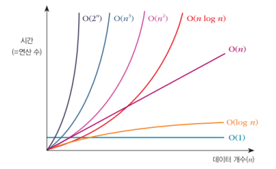

## 알고리즘 특강(1일차)

- 목적: 자료구조/알고리즘의 기본은 탄탄!, 다른이에게 알고리즘을 알려줄 수 있도록 정리~

- 자료구조: 요리의 재료
- 알고리즘: 요리하는 방법

- 자료구조의 종류
  - 단순 자료구조
    - 정수
    - 실수
    - 문자
    - 문자열
  - 선형 자료구조(실제 공부)
    - 리스트(연결, 원형): 파이썬의 리스트(array)와 다르다.
    - 스택
    - 큐(일반, 원형)
  - 비선형 자료구조(실제 공부)
    - 트리
    - 그래프
  - 파일 자료구조
    - 순차 파일
    - 색인 파일
    - 직접 파일


###  자료구조의 개념과 종류

- 선형 자료구조
  - 데이터를 한 줄로 순차적으로 표현한 형태, 선형 리스트, 연결 리스트, 스택, 큐 등

- 비선형 자료구조
  - 하나의 데이터 뒤에 여러 개가 이어지는 형태. 트리와 그래프 등


### 알고리즘

- 어떤 문제를 해결해 가는 논리적인 과정
- 알고리즘 종류
  - 정렬
    - 선택정렬
  - 검색
    - 순차검색
    - 이진 검색(중요!)
  - 재귀

- 알고리즘 표현법
  - 일반 언어 표현
  - 순서도를 이용한 표현
  - 의사코드를 이용한 표현(슈도 코드)
  - 프로그램 코드로 표현
  - 혼합형태
    - 간단한 알고리즘은 직접 코드로 작성
    - 복잡한 알고리즘은 일반 언어, 의사코드, 순서도 그림등을 종합적으로 활용해서 표현


- 알고리즘의 성능

  - 알고리즘 성능 측정

    - 알고리즘을 소요 시간을 기준으로 알고리즘 성능을 분석 방법이 시간복잡도(Time Complexity)

    - 빅-오 표기법(Big–Oh Notation)으로 O(f(n)) 형태

    - 대표적인 함수는 O(1), O(log n), O(n),  O(n log n), O(n2 ), O(n3 ), O(2n ) 정도이다.

      

### 선형 리스트의 기본

- 선형 리스트

  - 선형 리스트란?
    - 맛집이나 마트에서 줄을 서는 것처럼 데이터를 일정한 순서로 나열한 것
    - 데이터를 일정한 순서로 나열한 자료구조
    - 순차 리스트(Ordered List)라고도 함
    - 선형 리스트는 입력 순서대로 저장하는 데이터에 적당

- 선형 리스트의 원리

  - 데이터 삽입, 삭제

    ```python
    # 함수 부분 code03_02.py
    def add_date(friend):
        katok.append(None)
        kLen = len(katok)
        katok[kLen-1] = friend
    
    def insert_data(position, friend):
        katok.append(None)
        kLen = len(katok)
        for i in range(kLen-1, position, -1):
            katok[i] = katok[i-1]
            katok[i-1] = None
        katok[position] = friend
        
    def delete_data(position):
        kLen = len(katok)
        for i in range(position, kLen, 1):
            katok[i-1] = katok[i]
            katok[i] = None
        del(katok[kLen-1])    
        
    # 전역 변수 부분
    katok = []
    katok
    
    # 메인 코드 부분
    
    add_date('다현')
    add_date('모모')
    add_date('쯔위')
    add_date('미나')
    
    insert_data(3,'강산')
    insert_data(1,'지효')
    
    delete_data(3)
    ```

    

### 단순 연결 리스트의 기본

- 단순 연결 리스트란?

  - 방문할 맛집을 지도에 순서대로 연결한 것처럼, 떨어진 곳에 위치한 데이터를 화살표로 연결한 것

- 단순 연결 리스트의 개념

  -  노드들이 물리적으로 떨어진 곳에 위치

  - 각 노드의 번지도 순차적이지 않음

  - 화살표로 표시된 연결(링크, Link)을 따라가면 선형 리스트 순서와 같음

    

  - 데이터를 삽입/삭제할 때

    - 선형 리스트는 많은 작업이 필요(오버헤드 발생) 

    - 단순 연결 리스트는 해당 노드의 앞뒤 링크만 수정하면 되므로 오버헤드가 거의 발생하지 않음(연결 리스트의 엄청난 장점!!)

      

- 단순 연결 리스트의 원리

  - 노드구조

    - 단순 연결 리스트는 다음 데이터를 가리키는 링크가 더 필요
    - 노드(Node)는 데이터와 링크로 구성된 항목

  - 노드(데이터) 삽입

    

    - 첫 번쨰 노드 삽입
    - 중간 노드 삽입
    - 마지막 노드 삽입

  - 노드(데이터 삭제)

    - 첫 번째 노드 삭제
    - 첫 번째 외 노드 삭제

  - 노드 검색

  - 연결 리스트 코드 정리

  ```python
  ## 함수/클래스 선언부 code04_08.py
  
  class Node():
      def __init__(self):
          self.data = None
          self.link = None
  
  def printNode(start):
      current = start
      while current.link != None:
          print(current.data)
          current = current.link
      print(current.data)
  
  def insertNode(findData, insertData):
      global head, current, pre
      if head.data == findData:           # 첫 노드 앞에 삽입할 때
          node = Node()
          node.data = insertData
          node.link = head
          head = node
          memory.append(node)
          return
      # 사나 앞에 솔라를 삽입해라
      current = head 
      while current.link != None:
          pre = current
          current = current.link
          if current.data == findData:
              node = Node()
              node.data = insertData
              node.link = current
              pre.link = node
              memory.append(node)
              return
      # 마지막에 추가할 때 (= 삽입할 이름이 존재하지 않을때)
      node = Node()
      node.data = insertData
      current.link = node
      return
  
  def deleteNode(deleteData):
      global head, current, pre
      # 첫 노드 삭제
      if deleteData == head.data:
          current = head
          head = head.link
          del(current)
      # 첫 노드 외의 노드 삭제
      current = head
      while current.link != None:
          pre = current
          current = current.link
          if current.data == deleteData:
              pre.link = current.link
              del(current)
              return
          
  def findNode(findData):
      global head, current, pre
      current = head
      if current.data == findData:
          return current
      while current.link != None:
          current = current.link
          if current.data == findData:
              return current
      return Node()
  
  ## 전역 변수
  memory = [] # 만든 애들을 담아둔다.
  head, current, pre = None, None, None
  dataArrary = ['다현', '정현', '쯔위', '사나', '지효']
  
  ## 메인 코드부
  ## 연결 리스트를 좀 더 범용적으로 만들기
  node = Node()
  node.data = dataArrary[0]
  head = node                             # 헤드 생성
  memory.append(node)
  
  for data in dataArrary[1:]:             # 이후 data들을 연결해 주기
      pre = node                          # pre 변수에 직전 node를 저장해 두기
      node = Node()
      node.data = data
      pre.link = node
      memory.append(node)
      
  printNode(head)
  
  # 처음 삽입
  insertNode('다현', '화사')
  printNode(head)
  
  # 중간 삽입
  insertNode('사나', '솔라')
  printNode(head)
  
  # 마지막 삽입
  insertNode('강산', ' 문별')
  printNode(head)
  
  # 첫 노드 제거
  deleteNode('화사')
  printNode(head)
  
  # 첫 노드 이외 제거
  deleteNode('쯔위')
  printNode(head)
  
  # 
  
  fNode = findNode('다현')
  print(fNode.data)
  
  fNode = findNode('사나')
  print(fNode.data)
  
  fNode = findNode('세훈')
  print(fNode.data)
  ```

  

### 스택의 기본

- 스택의 개념

  - 스택(Stack) 자료구조는 한쪽 끝이 막힌 형태(ex : 한쪽 끝이 막힌 주차장, 종이컵 수거함 등)
  - 입구가 하나이기 때문에 먼저 들어간 것이 가장 나중에 나오는 구조(선입후출, 후입선출) = first in last out

- 스택 원리

  - 스택 기본 구조

    - 스택에 데이터를 삽입하는 작동 : push 

    - 스택에 데이터를 추출하는 작동 : pop

    - 스택에 들어 있는 가장 위의 데이터 : top

      

  - 스택 코드 정리

  ```python
  ## 함수 code06_07.py
  def isStackFull() :
      global stack_size, stack, top
      if (top >= stack_size-1):
          return True
      else:
          return False
  
  def push(data) :
      global stack_size, stack, top
      if isStackFull():
          print("stack 꽉!!")
          return
      top+=1
      stack[top] = data
      
  def isStackEmpty() :
      global stack_size, stack, top
      if top <= -1:
          return True
      else:
          return False
      
  def pop() :
      global stack_size, stack, top
      if isStackEmpty():
          print('스택 비었습니다.')
          return None
      data = stack[top]
      stack[top] = None
      top -= 1
      return data
  ## 전역
  stack_size = 5
  stack = [None]*stack_size
  top = -1
  
  ## 메인
  
  # push
  push('맥주')
  print(stack)
  
  push('맥주1')
  print(stack)
  
  push('맥주2')
  print(stack)
  
  push('맥주3')
  print(stack)
  
  push('맥주4')
  print(stack)
  
  push('맥주5')
  print(stack)
  
  # pop
  data = pop()
  print(stack)
  ```

  